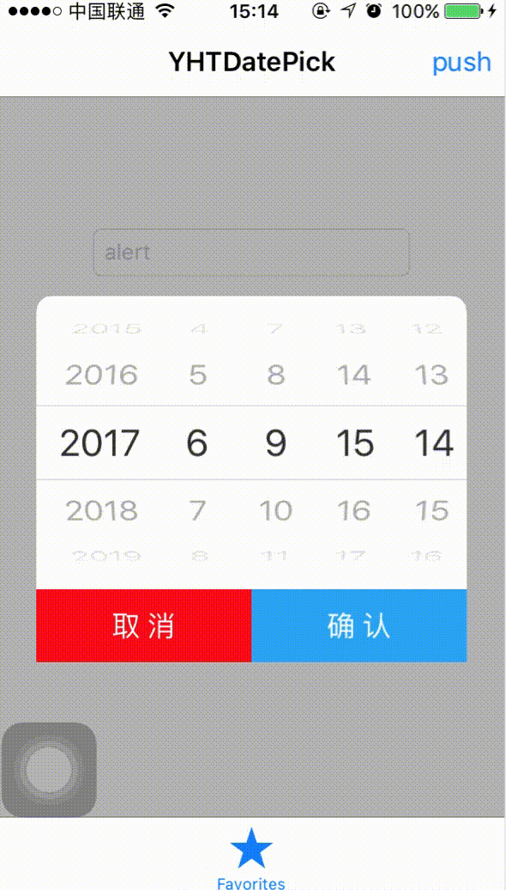
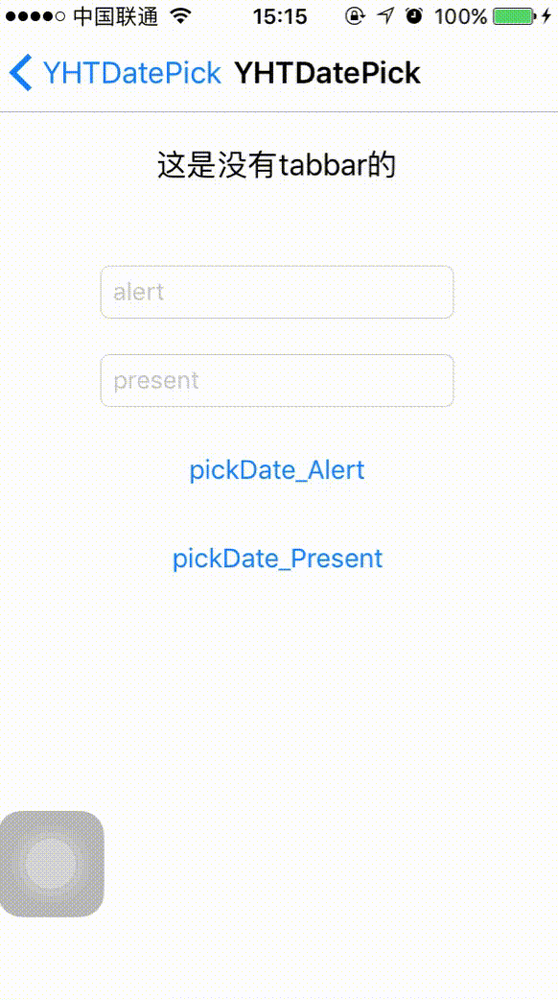

# YHTDatePicker

## 这是一个简单的日期选择空间，支持中心弹窗和底部弹出两种方式。

### 效果
 

### 使用：

```
    YHTDatePickViewController *picker = [[YHTDatePickViewController alloc] initWithTimeFormat:YHTDateType_Minute];
    [picker showType:YHTViewType_Present parentViewController:self completion:^(NSDate *date) {
        NSLog(@"%@", date);
    }];
```

调整精确度：

在初始化选择器时通过枚举控制，包含如下：

```
typedef NS_ENUM(NSUInteger, YHTDateType) {

    YHTDateType_Year = 1,
    YHTDateType_Month,
    YHTDateType_Day,
    YHTDateType_Hour,
    YHTDateType_Minute
};
```

控制展现方式：

```
typedef NS_ENUM(NSUInteger, YHTViewType) {

    YHTViewType_Alert = 1,
    YHTViewType_Present = 2
};

parentViewController应该填写要展示在的控制器上
```

注意： 

该时间选择器底部弹窗时，不论是否包含tabbar都可以正常展示，若不能展示，请查看要展现在的控制器的以下连个个属性：

```
    self.automaticallyAdjustsScrollViewInsets = false;
    self.edgesForExtendedLayout = UIRectEdgeNone;
```
正常设置后应该可以正常展示。


详情可见示例。


